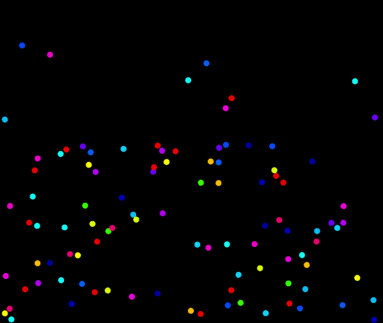
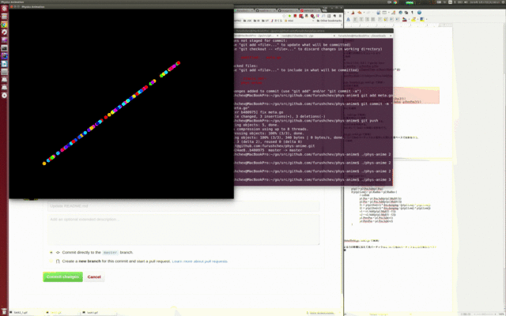
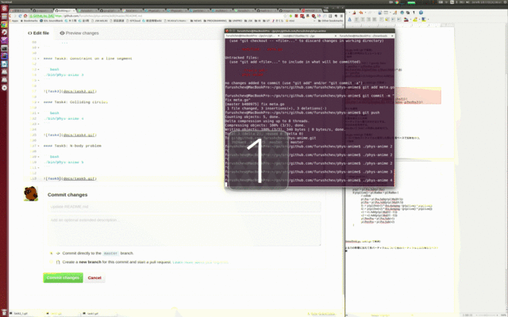
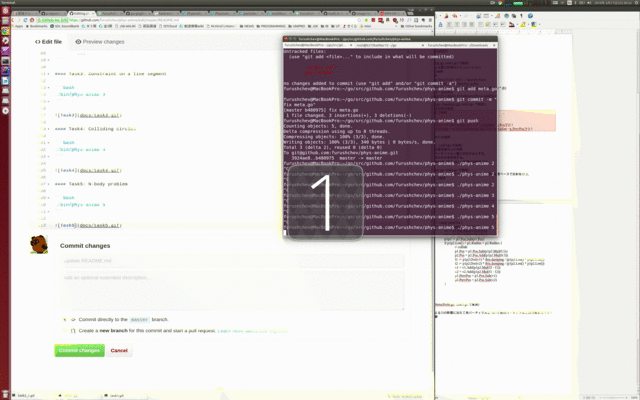

# phys-anime [](https://travis-ci.org/furushchev/phys-anime)

### Build

Tested on `Ubuntu 14.04` 

```bash
sudo apt-get update
sudo apt-get install golang-1.6-go git libgl1-mesa-dev xorg-dev
export PATH=/usr/lib/go-1.6/bin:$PATH
mkdir go
cd go
export GOPATH=`pwd`
go get github.com/furushchev/phys-anime
```

### Usage

```bash
./bin/phys-anime [Task ID]
```

- Task ID is described below.
- Press `q` to exit window

### Config

You can configure general settings by editting `meta.go`

```go
// Settings
const (
	WindowWidth = 1280
	WindowHeight = 1080
	FrameRate = 60
	NumParticles = 100
	Task3LineStartPos = []int{200, 200}
	Task3LineEndPos = []int{1000, 800}
)
```

After editting, you will need to re-compile by

```bash
cd $GOPATH
go build github.com/furushchev/phys-anime
```


### Task Explanation
#### Task1: Trajectory under gravity

```bash
./bin/phys-anime 1
```


Implement Gravity using Verlet Integration


```go
// gravity.go
	prev2Pos, prevPos := p.PrevPos, p.Pos
	fVec := this.Force(this.ElapsedTime, p.Mass).Mul(dt * dt)
	p.PrevPos = prevPos
	p.Pos = prevPos.Mul(2.0).Sub(prev2Pos).Add(fVec)
```

#### Task2: Elastic collision

```bash
./bin/phys-anime 2
```



Implement collision between particles and screen boundaries

```go
// boundary.go より抜粋
	// floor
	if p.Pos.Y() - p.Radius < 0 {
		p.Pos = m.Vec2{p.Pos.X(), 2.0 * p.Radius - p.Pos.Y() }
		p.PrevPos = m.Vec2{p.PrevPos.X(), 2.0 * p.Radius - p.PrevPos.Y() }
	}
	...
```

#### Task3: Constraint on a line segment

```bash
./bin/phys-anime 3
```



#### Task4: Colliding circles

```bash
./bin/phys-anime 4
```



#### Task5: N-body problem

```bash
./bin/phys-anime 5
```


